# first_trial

A word list app implemented using Flutter. This application aims
to help learning and reviewing words, instead of searching words 
in a dictionary.

## Installation

Download the installation pack here:
[https://github.com/lll-jy/flutter-trial/releases/tag/v0.1.0](https://github.com/lll-jy/flutter-trial/releases/tag/v0.1.0)

If you are deploying as developers using the source code, follow the guide here:
[https://flutter.dev/docs/get-started/install/](https://flutter.dev/docs/get-started/install/)

**Note**

Please allow the app to access bluetooth, etc.

## Guide

### Introduction

When the app is started, the interface is as follows, 
containing a drawer button and a list of words.

Note that if the app is started for the first time,
the list of words is the sample words.

You can open the toolkit drawer by tapping the top left corner.
After tapping, you would see something like this.

### Add new word

You can add a new word by tapping the `Add new words` in the toolkit drawer.
This will lead you to the following page.

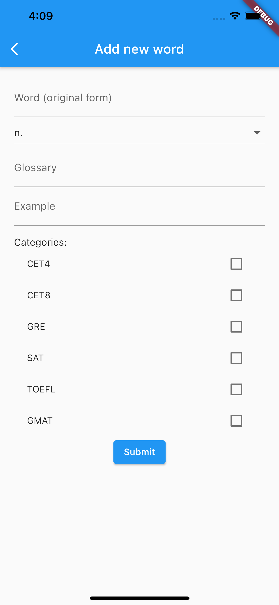

You can key in the information of the word according to the dictionary, including the
word, part of speech (select exactly one, as seen in the picture below), glossary, and example.

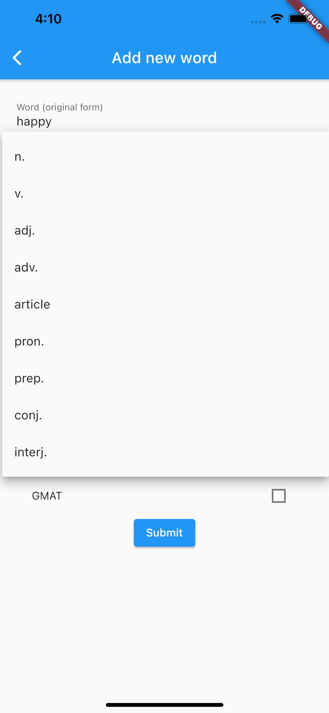

You can specify the word into some categories, including CET4, CET8, GRE, GMAT, TOEFL, and SAT.
One word may belong to one or more categories, or no categories.

An example of completed form for adding a word is as follows.

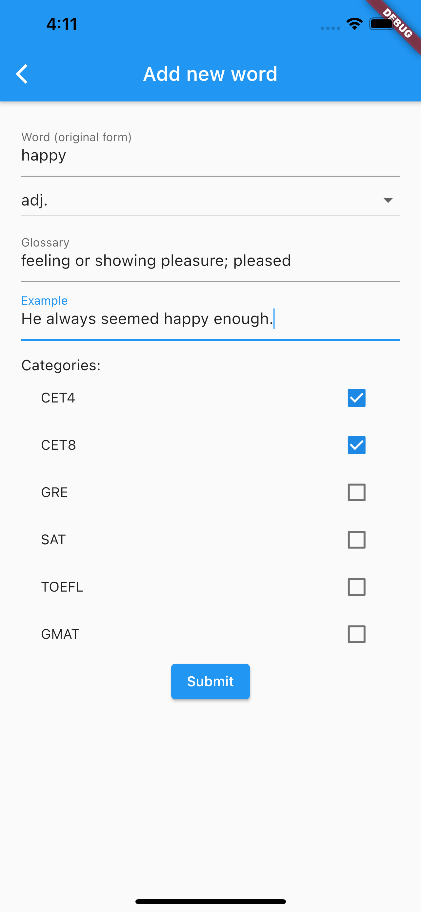

Note that the word itself should be unique. If you intend to add a word that already exists in the app,
you will see something like this after tapping submit button.

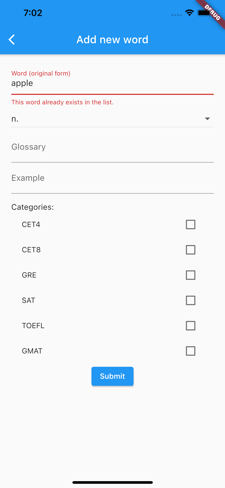

After you tap the submit button, you will return to the word list page (with filters, whose details
will be given in the subsequent sections, retained), and the new word is added to the end of the list.
The picture below is the result after tapping submit in the previous picture.

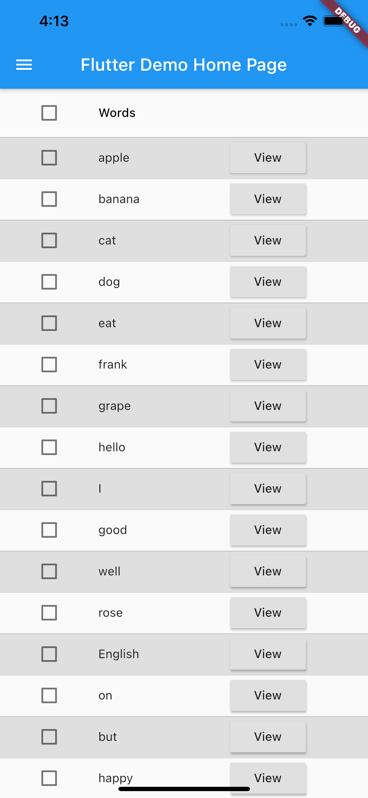

**Possible feature extensions**
1. Allow the user to specify customized category.
1. Find a way to solve situations where one word has multiple meanings, especially multiple possible
part of speech.

### View word details

In the word list, you can only see the word itself. If you want to see the details
you added, such as glossary and example, you can tap the view button at the right of 
each word in the word list. This will guide you to a view page, an example of which 
is shown as follows.

### Edit a word

If you accidentally keyed in some wrong information about a word, you can edit it.
You can open the edit page by tapping the `Edit` button in the view page, which will
guide you to the following page.

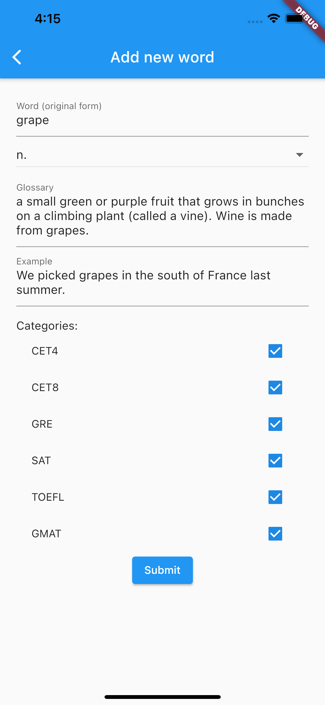

The form is filled with original information of the word. You can change it in whatever
way you want. For example, in the picture below, an 's' is added at the end of the word.

After you've updated all information you want to change, you can submit, which will lead
you back to the view page with updated information.

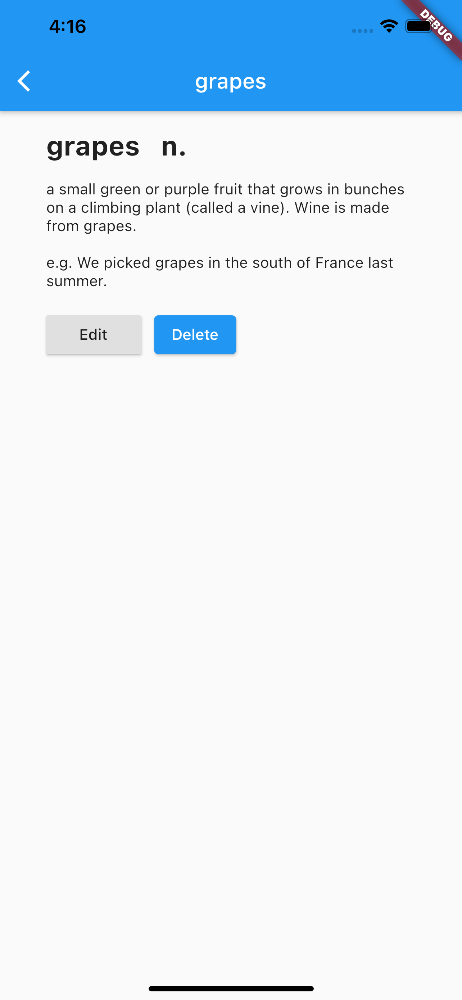

If you go back to the list page, the list will also show the updated version of word.

### Delete a word

If you no longer want to keep a word in the app, for example, you don't
want the word in the picture below anymore.

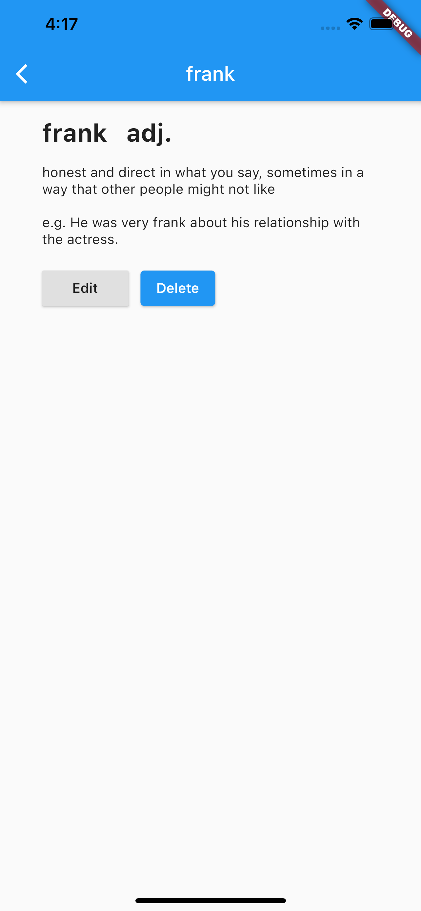

You can tap the delete button, which will delete this word in the word list
and return to the word list page with this word removed.

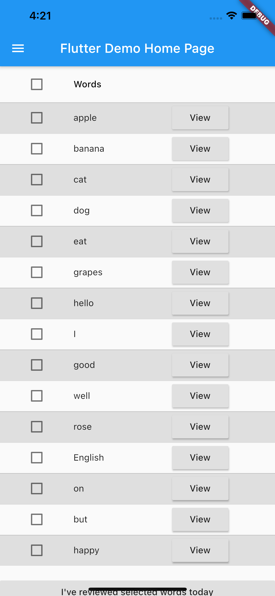

### Filter

#### Filter by whether assigned today

You may want to see the words that are assigned for today to review.
You can see the filtered wordlist by using the switch in the toolkit drawer as follows.

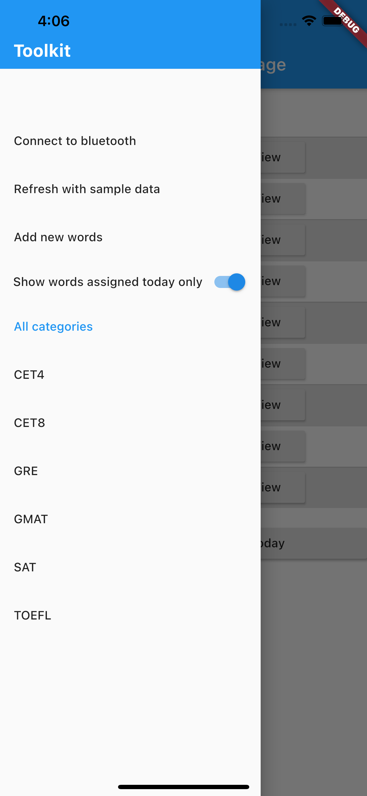

Then close the drawer, you can see the list of words assigned today only.

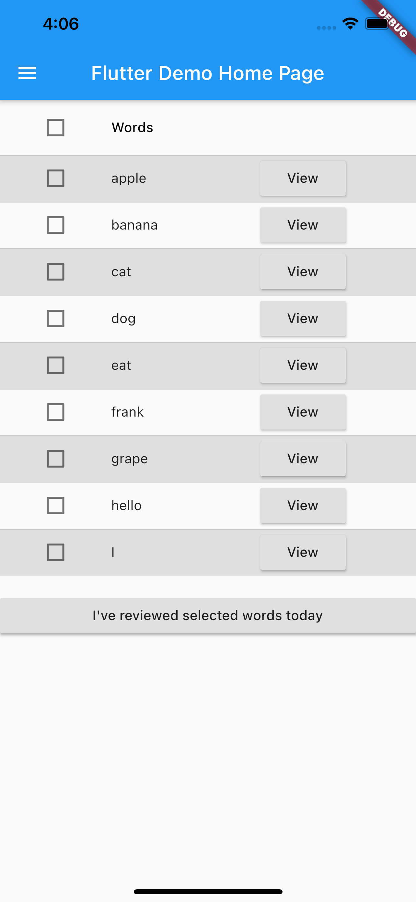

#### Filter by category

You may want to see words only belong to one of the categories. For example, you want to see
the words for GRE, then in the drawer, you tap GRE, you can get the filtered list. The resulting
list is seen as follows.

Note that category and today filter are connected by `AND`.

If you want to check which category you are in, you can open the drawer, the selected category is highlighted.

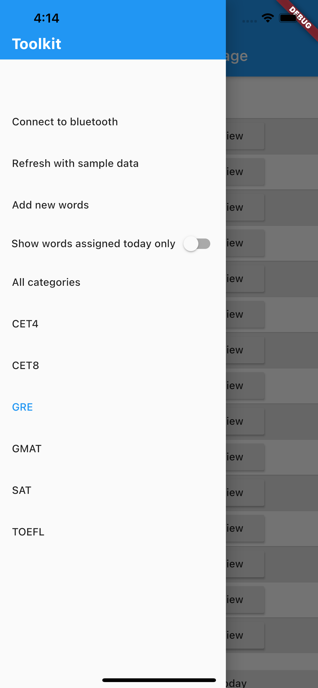

**Possible feature extensions**
1. Filter by other conditions on review date, for example, assigned this week, assigned before today, etc.
1. Search word by key in the word.
1. Sort words.
1. Filter by categories with some and/or connector.

### Review

You can select some words that you want to mark as reviewed today
by checking the checkbox in front of the word such as follows.

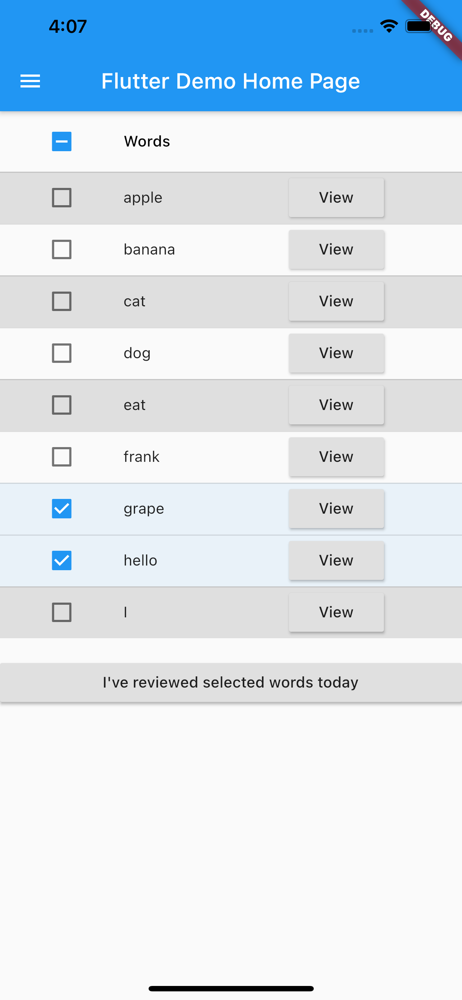

You can also select all by checking the checkbox in front of the list header.

Then, you can tap the button at the bottom to mark the selected words as reviewed today.
If you are under the filter of today only set to true, then the words will disappear in the
list displayed because the expected review date is updated when it is marked reviewed today.
For example, if you mark the words selected in the previous picture as reviewed, you will
get something as follows.

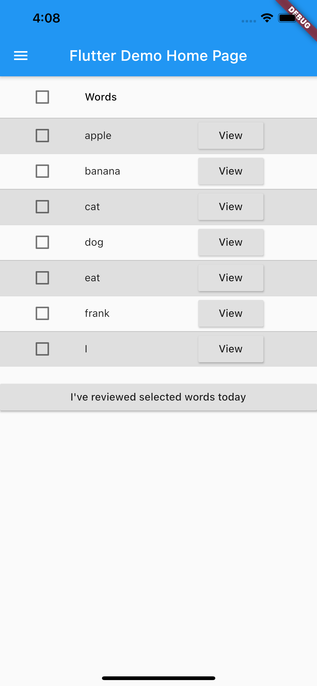

The app will note down the review date and calculate the review date for the next round for you automatically.
Note that reviewing a word not assigned today is allowed.

**Rule for the next date to review**
1. When the word is created, namely, first added to the app, the review date is set to be 1 day after today, let's call this 1 day `interval`.
1. In general, the expected review date is `interval` days after the last review date.
1. When the word is reviewed, the last review date is updated to today and `interval` increments by 2.

**Possible feature extensions**
1. Set the incrementation of `interval` to make more sense according to some research on memory.
1. Allow user to set customized `interval`.
